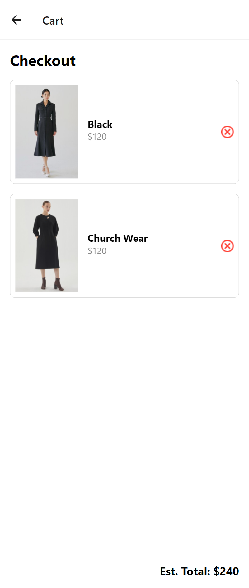

# README

## Overview

This application is a simple shopping cart built with React Native. Users can view a list of available products, add them to their cart, and remove them from their cart. The cart items are stored locally on the device using AsyncStorage.

## Features

- **Home Screen**: Displays a list of available products.
- **Cart Screen**: Displays the items added to the cart.
- **Add to Cart**: Users can add products to their cart from the Home Screen.
- **Remove from Cart**: Users can remove products from their cart from the Cart Screen.
- **Local Storage**: Selected items are stored locally on the device using AsyncStorage.

## Data Storage

- **AsyncStorage**: Used to store and retrieve the cart items. When a user adds or removes an item, the cart state is updated and saved to AsyncStorage. On app load, the cart state is retrieved from AsyncStorage.

## Screenshots

### Home Screen

### Cart Screen

